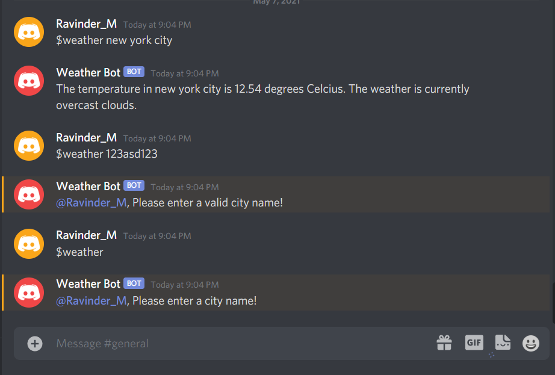

Discord Weather Bot

This discord bot was developed using Node and Discord.js to power the bot and connect to discord servers. The bot uses the OpenWeather API to take the discord command arguements and output weather results on matching cities.

